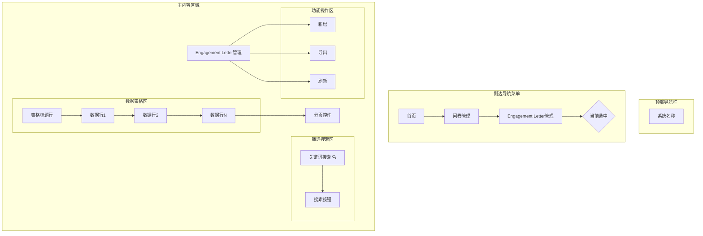

# Engagement Letter管理页面布局设计

## 整体结构
1. 顶部导航栏
   - 系统标志/名称

2. 侧边导航菜单
   - 首页
   - 问卷管理
   - Engagement Letter管理（当前选中）

3. 主内容区域
   - 页面标题栏：Engagement Letter管理
   - 功能操作区
     - 新增按钮：创建新的Engagement Letter
     - 导出按钮：导出选中的Engagement Letter数据
     - 刷新按钮：刷新当前页面数据
   - 筛选搜索区
     - 关键词搜索：输入框（支持名称模糊搜索）
     - 搜索按钮：执行筛选操作
   - 数据表格区
     | 列名           | 描述                     | 操作                           |
     |----------------|------------------------|--------------------------------|
     | 名称           | 文档标题               | 点击可查看详情                 |
     | 关联问卷名称     | 关联问卷名称           | 显示问卷名称                   |
     | 创建日期       | 文档创建时间           | 格式：YYYY-MM-DD HH:MM         |
     | 最后修改日期   | 文档最后修改时间       | 格式：YYYY-MM-DD HH:MM (如未修改则为空) |
     | 状态           | 当前状态               | 正常/已删除（基于IsDeleted字段）|
     | 操作           | 功能按钮组             | 预览、编辑、删除、导出报告      |
   - 分页控件
     - 页码导航
     - 每页显示条数选择器
     - 总记录数显示

## 页面交互说明
- 点击表格中的"查看"按钮，跳转至详情页面
- 点击"编辑"按钮，打开编辑模态框或跳转至编辑页面
- 点击"删除"按钮，触发确认对话框后执行删除操作
- 点击"导出报告"按钮，触发确认对话框后执行导出操作
- 表格支持按列排序（点击列标题）

## 布局示意图
